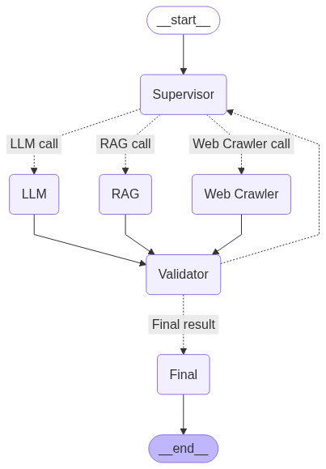
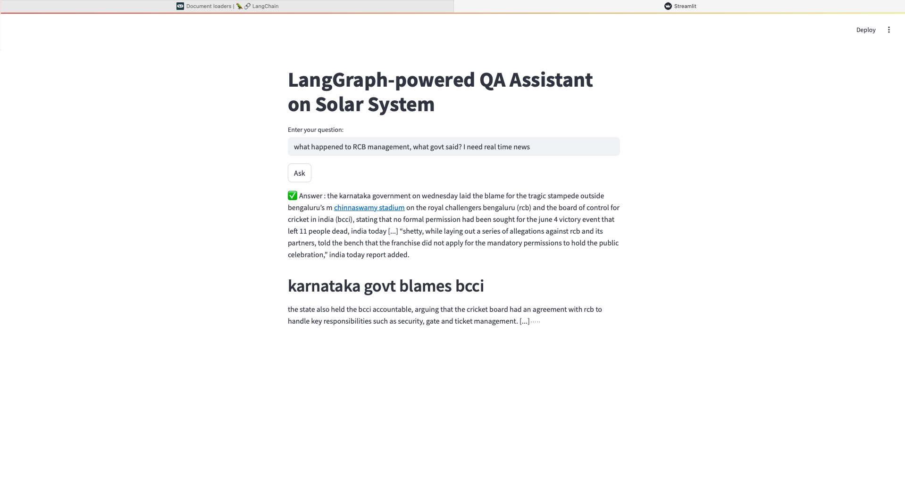

# 🛰️ Assignment 4: RAG Pipeline with Supervision, Validation & Real-time Search

## 📌 Objective

This project implements a **multi-node graph** for information retrieval and reasoning using `LangGraph`. The system intelligently routes tasks between different nodes—RAG, LLM, and Web Crawler—while incorporating a **supervisor** for control flow and a **validation node** to ensure high-quality outputs.

The pipeline is demonstrated on a **Solar System research paper**, performing real-time research and Q&A using RAG + LLM with fallbacks and corrections based on validation.

---

## 🔧 Architecture Overview

### 🧠 Nodes

- **Supervisor Node**  
  Controls the flow of the task. Decides which node (RAG, LLM, or Web Crawler) to call based on task state or previous validation result.

- **Router Function**  
  Routes the incoming query to one of the downstream nodes based on supervisor instructions.

- **LLM Node**  
  Calls an Gemeni model to generate responses using only model knowledge.

- **RAG Node**  
  Performs Retrieval-Augmented Generation over a **Solar System** research paper.

- **Web Crawler Node**  
  Uses `Tavily` or similar tools to fetch **real-time data** from the web.

- **Validation Node**  
  Evaluates the generated output for correctness, completeness, and factuality.  
  If the validation fails, control is returned to the **Supervisor Node** for re-routing.

---

## 🔁 Workflow

1. **Input Query** is received by the `Supervisor Node`.
2. The **Router** sends it to either:
   - RAG Node
   - LLM Node
   - Web Crawler
3. The selected node generates an **intermediate answer**.
4. **Validation Node** checks the answer.
5. If **validation fails**, control returns to the **Supervisor** to try another node.
6. If **validation passes**, the **final answer** is generated and returned.

---

## 📚 Dataset / Document

- The RAG component is built on a **Solar System research paper**.
- The paper is chunked, embedded, and stored in a vector store.

---

## 🚀 Technologies Used

- **LangGraph**
- **LangChain**
- **Google Gemini API**
- **Pinecone VectorDB**
- **Tavily** for web scraping
- **Python 3.11**
- **VSCode with Miniconda**

---

## Streamlit UI Sample

